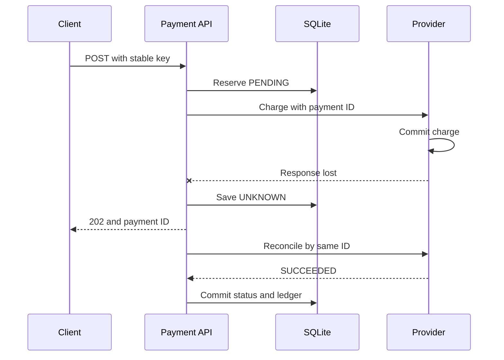
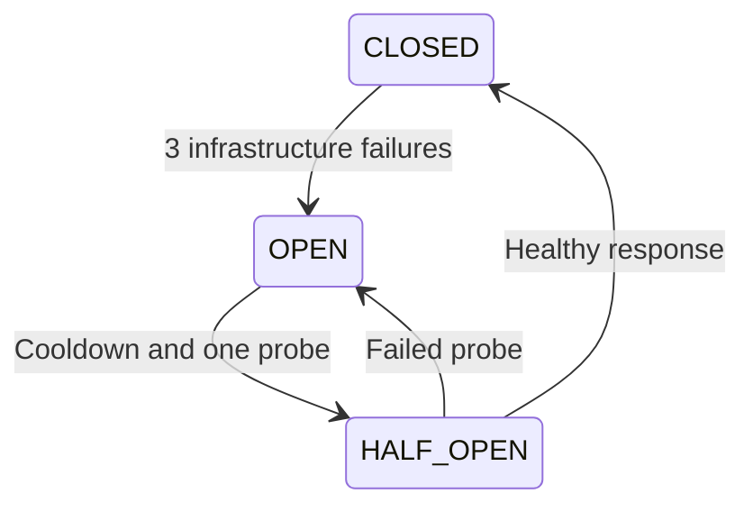

# 障害に強い決済システムを実装から理解する

確認日: 2026-09-06。これは実際のカードを扱わないローカル教材です。決済APIはTypeScript・Go・Javaで独立実装し、同じHTTP契約と同じ障害テストで比較します。Pythonは決済会社の模擬サーバー、共通テスト、運用スクリプトに使います。

## 最初に覚えること

**タイムアウトは「失敗した」ではなく「結果が分からない」です。**

顧客が支払いを押す。自社APIは決済会社へ請求する。決済会社は成功を保存する。しかし応答が届く前に接続が切れる。このとき自社が失敗と断定し、新しいキーで再請求すると二重請求になります。

本教材では、ローカルに`PENDING`を先に保存し、外部呼び出しにその決済IDを使います。結果が分からなければ`UNKNOWN`を保存し、同じIDで結果を照会します。



HTTPの成功と決済の成功は違います。`201`で`DECLINED`を返すこともあります。このAPIの`201`は決済操作の記録を作成したという意味です。呼び出し側は必ず`status`を確認します。

## 元記事の読み方と訂正

Shopifyの元記事は2022-07-28公開であり、2026年の新規記事ではありません。設計原則は使えますが、数値や製品の既定値は現在の利用環境で確認します。

| 論点 | 正確な理解 |
| --- | --- |
| タイムアウト | 原文の出発点は接続1秒、読み書き・クエリ5秒。転載文の「write 1秒」と異なる。普遍的な推奨値ではない |
| 50件と100ms | 一度50件到着しただけでは500件/秒にならない。平均システム内件数と平均滞在時間、または並行処理枠と処理時間の前提が必要 |
| ULID | Shopifyの選好。冪等性に必須ではない。本教材はUUID v4を内部IDに使い、クライアントキーは許可文字の文字列とする |
| exactly once | ネットワーク全体の無条件な保証ではない。永続的な操作ID、DB制約、決済会社の冪等性、復旧処理を組み合わせて重複した副作用を防ぐ |

出典: [Shopify原文](https://shopify.engineering/building-resilient-payment-systems)。以降の実装、故障例、数値設定は本教材の設計です。

## 1. タイムアウトを明示する

外部依存が停止しても、接続や実行枠を永久に占有しないようにします。本教材の外部呼び出し予算は**1回300ms**です。意図的に短くし、800ms遅延の障害をすぐ観察できる設定です。本番向けの推奨値ではありません。

| 言語 | 実装 | 注意点 |
| --- | --- | --- |
| TypeScript | `fetch`と`AbortSignal.timeout` | レスポンス本文の読み取りにも期限を適用する |
| Go | `http.Client.Timeout`と`context.WithTimeout` | リクエスト・本文まで予算に含む。外部処理はクライアント切断だけでは停止できない |
| Java | `HttpClient.sendAsync`と期限付き`get` | ヘッダーだけで終わらないよう本文完了まで待つ。独自BodySubscriberで16KiBに制限する |

照合は、照会後に404なら再送するため、1件最大2回の外部呼び出しです。1バッチ100件、ネットワーク予算は概算最大60秒。DB待ち時間は別です。操作全体の厳密なdeadlineやバッチの公平性は本番化で追加します。

実験: `python3 scripts/demo.py`。`UNKNOWN`から`SUCCEEDED`へ変わり、模擬決済会社の成功レコード数が増えないことを確認します。

## 2. Circuit Breakerで連続障害を遮断する

失敗が続く相手に毎回300ms待つと、サービス全体の実行枠を浪費します。3回の連続したインフラエラーでOPENにし、1秒後に1件だけ回復確認します。



`DECLINED`は正常に受け取った業務結果なので、Breakerのエラーに数えません。決済会社の429・503、不正な本文、通信断はインフラ側の失敗です。

並行実行では「古い成功応答が、直後に開いたBreakerを閉じる」という競合もあります。本実装では呼び出しに世代番号を持たせ、古い世代の完了を無視します。HALF_OPEN中は1件だけ通します。単体テストは時計を差し替えるため、実時間のsleepに依存しません。

本教材は模擬Providerが1つなのでBreakerも1つです。本番はProvider・リージョン・経路など、実際の障害境界に合わせて分けます。

## 3. Capacity management

Little's Lawは定常状態の平均値について`L = λW`です。`L`はシステム内平均件数、`W`は待ち時間も含む平均滞在時間。`L=50, W=0.1s`なら`λ=500/s`です。「待ち行列に50件ある」という瞬間値だけでは計算できません。

別の容量近似として、並行処理枠が50、各処理が平均100ms、他のボトルネックがないなら`50 / 0.1 = 500 req/s`です。1ワーカーなら約10 req/sです。

本実装の`MAX_INFLIGHT=8`は外部呼び出しの同時実行上限です。Goはbuffered channel、JavaはSemaphore、TypeScriptは単一イベントループ上のカウンターを使います。満杯なら新規受付を`429`で拒否します。受付と外部呼び出しの間の競合により、既に保存した操作が実行枠を得られない場合は`202 UNKNOWN`にして照合対象に残します。

これは一定時間あたりの回数を制限するrate limiterとは異なります。Providerの同時実行数は制限しますが、TCP接続総数、ローカルDBの待機、未確定レコード総数までは制限しません。本番では入口のrate limit、待ち行列上限、加盟店ごとの公平性も設計します。

## 4. Monitoring and alerting

Google SREのfour golden signalsはlatency、traffic、errors、saturationです。[Google SRE](https://sre.google/sre-book/monitoring-distributed-systems/)

| Signal | 本実装 |
| --- | --- |
| Latency | `payment_http_duration_seconds_bucket`。`ok/pending/rejected/error`別のHTTP処理時間 |
| Traffic | `payment_http_requests_total`。routeとHTTP statusだけをラベルにする |
| Errors | HTTP 5xxと`payment_unresolved`。外部障害は202になり得るので5xxだけでは不足 |
| Saturation | `payment_provider_inflight / payment_provider_capacity` |

`/health`はプロセスのlivenessです。外部決済会社の正常性を保証しません。`/metrics`とhealthアクセスは主要なHTTP集計から除外します。

HTTPの`outcome="ok"`には正常な決済拒否も含みます。承認率は別の業務指標です。この教材では決済状態をDBで確認でき、本番ではProvider別・決済手段別に専用メトリクスを追加します。payment IDや顧客IDをメトリクスのラベルにするとcardinalityが増えるため使いません。

`ops/alerts.yml`は例示閾値の設定ファイルです。Prometheus自身やAlertmanager、通知先は起動・設定していません。[Prometheus公式](https://prometheus.io/docs/prometheus/latest/configuration/alerting_rules/)

## 5. Structured logging

1 HTTPリクエストを1行JSONとしてstdoutに出します。`request_id`は毎回生成する追跡ID、`payment_id`は再試行をまたいで同じ業務操作を表します。この2つを区別します。

```json
{"event":"http_request","request_id":"request-uuid","route":"create","status":202,"duration_ms":301,"payment_id":"payment-uuid"}
```

実際のログにはカード番号、CVV、APIトークン、クライアントの冪等性キー、リクエスト本文を出しません。raw URLではなく固定routeを記録します。集中ログ基盤は実装外です。JSON stdoutを収集基盤へ送る境界を残します。

## 6. Idempotency keys

クライアントは1つの支払い操作に対して同じキーを再利用します。再試行のたびにUUIDを作り直してはいけません。

DBは`UNIQUE(merchant, idem_key)`を持ちます。`INSERT ... ON CONFLICT DO NOTHING`で原子的に予約し、INSERTに成功したリクエストだけが初回の外部呼び出しを行います。キーが既存ならamountとcurrencyを比較し、異なれば409、同じなら現在の状態を返します。

これはStripe APIのレスポンスキャッシュを忠実に再現する実装ではありません。本教材は同じ操作の**現在状態**を返します。最初が202でも、復旧後の再試行は200 SUCCEEDEDになります。実サービスごとの冪等性仕様は別途確認します。[Stripe APIの冪等性仕様](https://docs.stripe.com/api/idempotent_requests)

内部IDは保存済み決済レコードのUUIDです。ProviderへはクライアントキーではなくこのIDを渡すため、加盟店間のキー衝突を避けます。キーのTTLは実装せず、教材DBでは保持し続けます。

**限界:** 別キーなら同じ注文も別操作になります。本番の注文IDと一意な支払い操作の関係は別に制約を設計します。冪等性キーは認証情報でも注文IDの代替でもありません。

## 7. Reconciliation

この教材では2種類を扱います。

1. **未確定操作の復旧:** `/admin/reconcile`がPENDING/UNKNOWNを最大100件取得。Providerで見つかれば内容を検証して確定。権威ある404なら同じ内部IDで再送。照会の503やtimeoutでは再送しない。
2. **明細照合:** `scripts/settlement.py`が完全な明細CSVとローカル全件を比較。金額・通貨・状態の不一致、Providerだけの記録、自社だけの記録、CSV重複を検出し、実行IDと入力ハッシュ付きでDBへ保存。

API復旧での不一致は`reconciliation_breaks`へ保存します。確定後に古いtimeout処理が遅れて到着しても、状態をUNKNOWNへ戻さず、未解決breakを再作成しません。明細照合の履歴は`settlement_runs`と`settlement_breaks`に残します。

本番の明細には期間、timezone、通貨、手数料、返金、settlement日、データ完全性の契約が必要です。このツールは**教材DB全体を対象とする完全な明細**だけを受け付ける運用です。日次の一部分を全DBと比較すると誤ったmissingが出ます。差額の自動修正や送金はしません。

## 8. Load testing

`scripts/load.py`は並行度を固定するclosed-loop方式です。完了req/s、p50/p95/p99、HTTP status、決済状態を出します。8並行、32並行などに変え、外部遅延あり・なしを比較します。

注意するのは、429が速く返るだけで平均レイテンシが改善して見えることです。SUCCEEDED件数も同時に見ます。この負荷ツールはflash sale全体を証明しません。open-loop到着率、地域分散、coordinated omission、長時間soak、DBサイズ増加の試験は別に行います。

## 9. Incident management

`ops/incident-template.md`でIMOC、SRM、service ownersの担当を決め、`docs/runbook-ja.md`で初動を揃えます。対応指揮、対外説明、修復作業を分担するためです。

UNKNOWNが増えたときは、決済失敗と断定せず、Providerの状態・タイムアウト・Breaker・DBの遅延を確認します。新しいキーで一括再請求してはいけません。影響範囲を把握し、同じIDの照合で回復させます。

## 10. Retrospectives

`ops/retrospective-template.md`に、何が起きたか、どの前提が誤っていたか、再発や影響を減らすには何を変えるかを記録します。

「注意する」で終わらず、担当、期限、検証方法を決めます。例えば「timeout後に新しいキーを発行していた」ならクライアント側の操作ID保存と再試行テストを追加します。「本文が届かず停止した」なら本文完了までのdeadlineをテストします。

## 台帳の最小モデル

SUCCEEDEDの確定と同じDBトランザクションで2行を記録します。

| Account | signed_amount（借方を正、貸方を負とする教材上の表記） |
| --- | ---: |
| psp_receivable | +1000 |
| merchant_payable | -1000 |

合計は0。`PRIMARY KEY(payment_id, account)`で再実行時も行数は2です。これは支払いを受け付けた際の債権・債務の単純化であり、実際の銀行着金、手数料、返金、為替、残高管理を実装した会計システムではありません。

DBトランザクションを開いたままProviderのHTTP完了を待ちません。外部との分散トランザクションを作らず、状態と照合で回復させます。[SQLiteのトランザクション](https://www.sqlite.org/lang_transaction.html)
