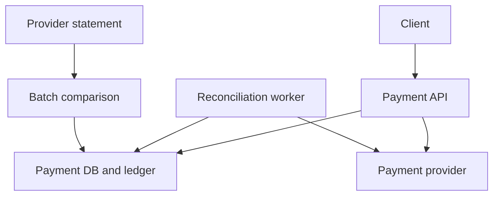

# Design a Resilient Payment System

## 30-sec summary

I would give each payment a stable operation ID.
I would store the request before calling the provider.
If the response is lost, I would keep the payment in an unknown state.
I would use the same provider key during recovery.
Short timeouts, a circuit breaker, and bounded concurrency protect capacity.
Reconciliation helps us reach the correct final state.

## Clarifying questions

- Do we support authorization, capture, refunds, or only a single charge?
- What are the peak request rate and latency target?
- Which currencies and payment providers do we support?
- How long does each provider retain idempotency keys?
- Can the provider return the result by operation ID?
- Can the client accept a pending response?
- What are the settlement and audit requirements?

## Requirements

Functional requirements:

- Create a payment and return its current state.
- Retry the same operation without a second charge.
- Reject the same key with a different amount or currency.
- Recover payments after timeouts or process crashes.
- Compare local records with provider statements.

Non-functional requirements:

- Durable payment records and ledger entries.
- Bounded dependency calls and controlled overload.
- Clear operational metrics and searchable logs.
- Correctness takes priority over a fast final answer.

For this exercise, I assume one charge operation, JPY and USD, and one provider.
Amounts use integer minor units. I do not use floating-point money.

## High-level design

The API reserves a payment under a unique merchant and idempotency key.
The payment ID becomes the provider idempotency key.
The provider call runs outside the database transaction.
The API stores the final state and ledger entries in one local transaction.

The demo uses SQLite and a mock provider.
For a distributed deployment, I would use a shared durable database and a durable work queue or outbox.

## Deep dive 1

### Idempotency and concurrency

I do not use a separate existence check followed by an insert.
Two requests could both pass that check.
I use a unique constraint on merchant ID and idempotency key.
Only the request that inserts the record starts the first provider call.

I compare the amount and currency for repeated requests.
If they differ, I return a conflict.
If they match, I return the same payment's current state.

A key prevents duplicate operations only when the client reuses it.
If a client creates a new key, I also need an order-level business rule.

### Crash boundaries

| Crash point | Recovery |
| --- | --- |
| Before the local reservation | The client can retry with the same key |
| After reservation, before the provider call | Reconciliation finds no charge and resubmits the same operation |
| After the provider commits | Reconciliation reads the provider result |
| During local finalization | The local transaction commits both state and ledger, or neither |

## Deep dive 2

### Protecting capacity

A timeout limits how long a call waits.
A circuit breaker stops calls to an unhealthy dependency.
A bulkhead limits concurrent calls.
A rate limiter limits requests over time.
These controls solve different problems.

For a simple estimate, 50 concurrent slots and 100 milliseconds of service time give about 500 requests per second.
This assumes enough demand and no other bottleneck.
A queue with 50 waiting requests does not prove that throughput.

I would use a retry budget with exponential backoff and jitter.
I would not retry every error at every layer.
A declined card is a business outcome, not a provider outage.

## Deep dive 3

### Unknown results, reconciliation, and observability

A timeout does not prove failure.
I return a pending response with a payment ID.
The client can check the result later.

The recovery worker first queries the provider.
If the result exists, it checks the ID, amount, and currency.
If the provider authoritatively reports no record, it may resubmit with the same key.
A failed lookup is not the same as a missing charge.

I also compare complete provider statements with local records.
I store mismatches for investigation instead of silently changing amounts.

I monitor latency, traffic, errors, and saturation.
I also track unresolved payments and reconciliation progress.
I use request IDs and payment IDs in structured logs.
I do not log card data or secret tokens.

## Tradeoffs

| Choice | Benefit | Cost or limit |
| --- | --- | --- |
| Short timeout | Releases local capacity sooner | More results need reconciliation |
| Pending response | Avoids a false failure claim | The client must handle asynchronous completion |
| SQLite in this demo | Easy local setup and real transactions | One writer; no distributed high availability |
| Provider idempotency | Makes retries safe within its contract | Depends on key retention and provider behavior |
| UUID v4 | Simple unique operation IDs | Does not provide time ordering |
| Polling recovery | Simple and testable | Adds delay and provider calls |

## Failure cases

- The provider commits but the response is lost.
- The process crashes before local finalization.
- Two clients send the same key at the same time.
- A retry changes the amount.
- The provider returns an invalid or mismatched response.
- A lookup fails, so the worker cannot know whether a charge exists.
- The provider forgets an old key. I must not blindly resubmit after that point.
- A statement is incomplete or uses a different time window.
- The database is unavailable. I do not start a new charge without a durable reservation.
- A backlog contains permanently bad records. I need per-item scheduling and a manual review path.

## 2-min English answer

I would start with one rule: a timeout does not mean the payment failed.
The provider may have charged the customer before we lost the response.

First, I would give each payment a stable operation ID.
I would store the request in a durable database before calling the provider.
A unique constraint on merchant ID and idempotency key would handle concurrent requests.
If the same key has a different amount or currency, I would reject it.

Next, I would call the provider with the same operation ID.
I would set a short timeout and limit concurrent calls.
A circuit breaker would stop calls during a provider outage.
A normal card decline would not count as an infrastructure error.

If the provider confirms success, I would update the payment and write the ledger entries in one local transaction.
If the result is unknown, I would return a pending response with the payment ID.

A reconciliation worker would query the provider and recover the final state.
It would reuse the same key when a retry is safe.
I would also compare provider statements with local records and store mismatches for review.

Finally, I would monitor latency, traffic, errors, saturation, and unresolved payments.
I would test lost responses, concurrent retries, and process crashes.
This design combines durable state, provider idempotency, and recovery.
It does not assume the network provides exactly-once delivery.

## Short phrases to remember

- A timeout means the result is unknown.
- Keep the same key for the same operation.
- Use a unique constraint, not a check-then-insert.
- A decline is a business outcome.
- Bound concurrency before adding retries.
- A failed lookup is not a missing record.
- Commit the state and ledger together.
- Reconciliation closes the gap.

## Follow-up practice

**Why not use Redis alone for deduplication?**

An expiring cache key is not a durable payment record.
I would keep the operation in the database and use Redis only when its role is clear.

**Why not switch providers immediately after a timeout?**

The first provider may already have charged the customer.
The second provider does not share the first provider's idempotency store.
I would resolve the first operation before starting another one.

**How would you add webhooks?**

I would verify the signature and store the event ID in a durable inbox.
I would handle duplicates and out-of-order events.
The state transition and event processing record would commit together.
Polling reconciliation would remain a recovery path.

**What is missing for production?**

Authentication, authorization, provider-specific contracts, key-retention rules, durable work scheduling, high availability, and full settlement accounting.
The demo does not process real card data.

References: [Stripe idempotency](https://docs.stripe.com/api/idempotent_requests), [Stripe webhooks](https://docs.stripe.com/webhooks), [Google SRE](https://sre.google/sre-book/monitoring-distributed-systems/).
